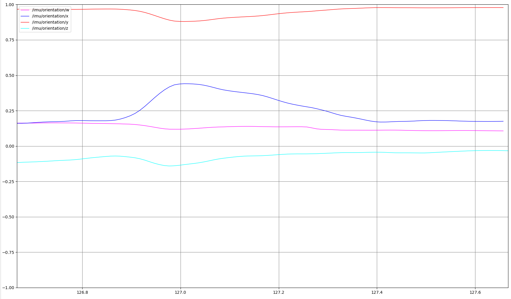
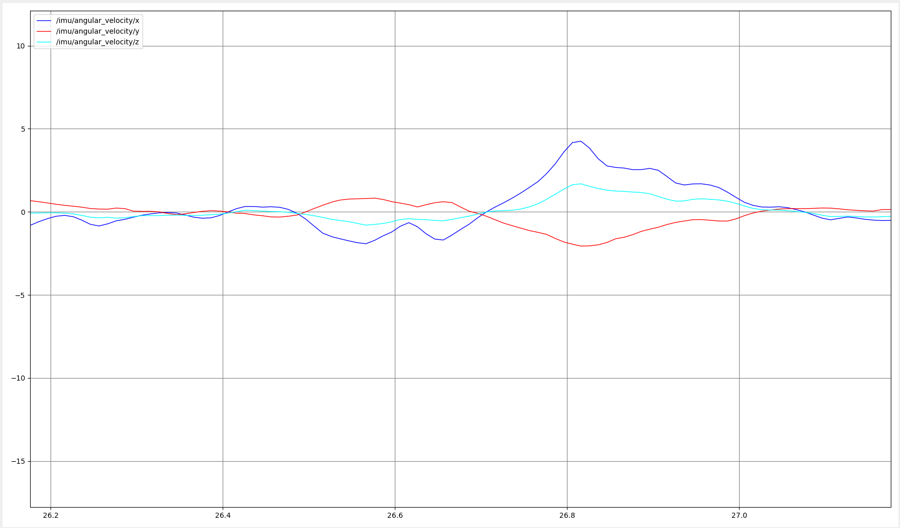
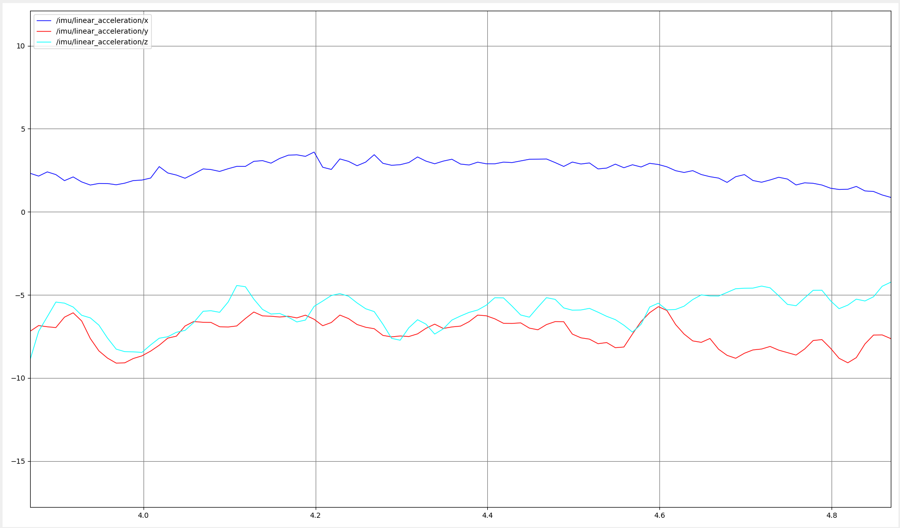
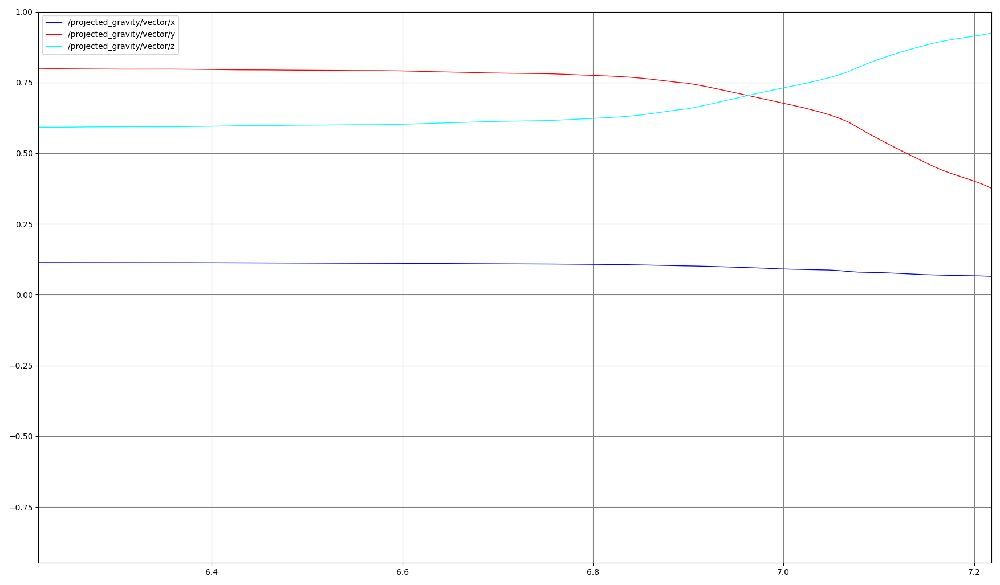

# imu_gravity

## Quick Start

```bash
source /opt/ros/humble/setup.bash
colcon build
source install/setup.bash
```

```bash
ros2 launch imu_gravity orientation_plot.launch.py serial_port:=/dev/ttyACM0
```

## Topic Plot

### 1. Orientation

```bash
ros2 launch imu_gravity orientation_plot.launch.py
```

Plots `/imu/orientation/x`, `/y`, `/z`, and `/w`.



### 2. Angular Velocity

```bash
ros2 launch imu_gravity angular_velocity_plot.launch.py
```

Plots `/imu/angular_velocity/x`, `/y`, and `/z`.



### 3. Linear Acceleration

```bash
ros2 launch imu_gravity linear_acceleration_plot.launch.py
```

Plots `/imu/linear_acceleration/x`, `/y`, and `/z`.



### 4. Projected Gravity

```bash
ros2 launch imu_gravity projected_gravity_plot.launch.py
```

The `imu_gravity` node subscribes to `/imu` and publishes `/projected_gravity`.

